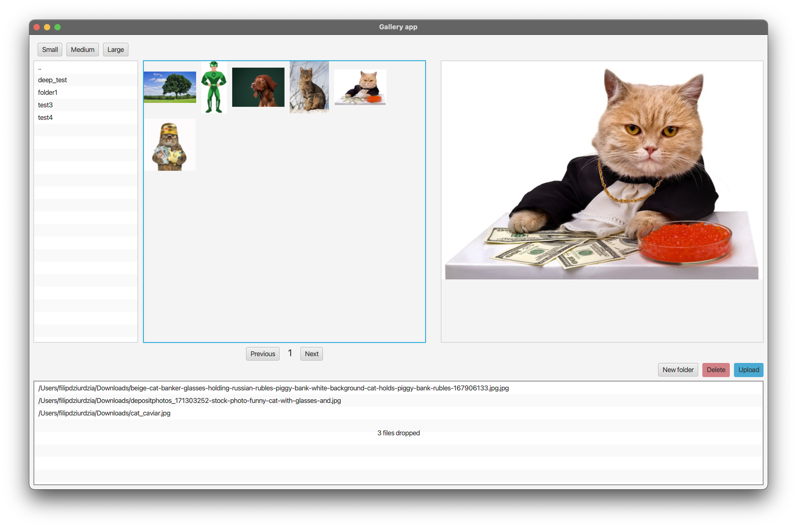

# Reactive Image Processing App

Welcome to the Reactive Image Processing App, a full-stack project that combines JavaFX and Java for the frontend and Kotlin Spring Boot with WebFlux for the highly responsive and reactive backend. We leverage Netty as a powerful server to ensure optimal performance and efficiency, and MongoDB serves as the backend's data storage.

## Features

- **Drag and Drop Functionality:**
  - Users can drag and drop images and zip files onto the frontend app for further processing.

- **Reactive Image Minimization:**
  - The backend processes images reactively, utilizing Kotlin Spring Boot's WebFlux framework and Netty as the server.

- **Folder Support:**
  - Both frontend and backend support organizing images in folders.

- **Grid of Miniatures:**
  - Once minimized, users can view a grid of image miniatures on the frontend.

- **Image Preview:**
  - Users can preview images by clicking on the miniature.

- **Pagination:**
  - App supports pagination for large image collections.

## Technologies Used

- **Frontend:**
  - JavaFX
  - Java

- **Backend:**
  - Kotlin
  - Spring Boot
  - WebFlux
  - Netty
  - Reactive Repository

- **Database:**
  - MongoDB

